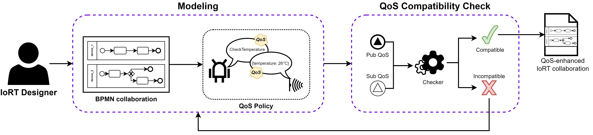
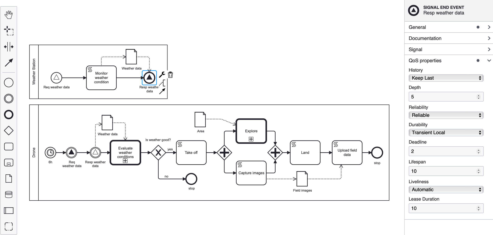

# C-QoS approach

The C-QoS approach, depicted in figure below, comprises two phases: modeling and QoS compatibility check. An IoRT designer models the system’s behavior in the modeling phase through BPMN collaboration diagrams. After that, in the QoS compatibility check phase, the approach ensures the compatibility of the modeled QoS policies. If all the policies are compatible, the output is an IoRT collaboration diagram enriched with QoS policies for enhanced communication.




## Our tool

C-QoS is the tool we developed to support our model-driven approach, that handles the complexity of representing Internet of Robotic Things (IoRT) systems and guarantees compatibility among QoS policies. By leveraging this approach, an IoRT designer can produce BPMN models that capture the key aspects of the system, including the interplay between devices, communication protocols, and QoS requirements. The C-QoS modeling phase is an extension of the bpmn-js toolkit that allowed us to create a web-based BPMN modeler enriched with the possibility of associating a set of QoS policies to each signal node. The tool automatically controls all the inserted QoS parameters, checking if the policies are compatible to establish a reliable communication between the involved devices.




## Running the Example

Install all required dependencies:

```
npm install
```

Build and run the project

```
npm start
```


## License

MIT
